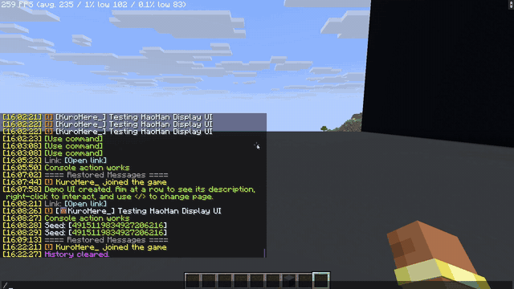

<div align="center">

# HaoHan Display UI

Plugin engine độc lập để dựng UI tương tác trong thế giới Minecraft bằng Display Entity.

[](https://www.minecraft.net/)
[](https://papermc.io/)
[](https://purpurmc.org/)
[](https://github.com/PaperMC/Folia)
[](https://github.com/pufferfish-gg/Pufferfish)
[](https://leavesmc.org/)
[](https://openjdk.org/)
[](https://gradle.org/)
[](https://docs.advntr.dev/)
[](https://junit.org/junit5/)

Ngôn ngữ: Tiếng Việt | [English](README.en.md)

</div>

## Tổng quan

HaoHan Display UI là plugin engine dành cho Paper/Purpur, cho phép plugin khác mô
tả giao diện 3D bằng static immutable document. Engine quản lý việc spawn, cập nhật,
ẩn/hiện và cleanup `TextDisplay`, `ItemDisplay`, `BlockDisplay`, mob entity cùng hitbox tương
tác raycast chính xác theo pixel.

Plugin không áp đặt menu hoặc gameplay cụ thể. Consumer có thể dùng engine để dựng
machine panel, bảng hướng dẫn, menu nhiều trang, danh sách vật phẩm, nút command,
link tài liệu, 3D custom entity/item model, Vanilla living mob tương tác, hoặc UI theo camera của từng người chơi.

## Video demo



[Tải/xem video chất lượng cao Demo.MP4](media/Demo.mp4).

Video trình bày lệnh `/hhdui demo` và các trang thử nghiệm:

1. Text thường, bold, italic, gradient động, obfuscated và mixed RGB.
2. Text list, icon list và icon đi kèm text.
3. Hover description và các hàng icon + text có thể click.
4. Camera billboard, khóa trục X/Y/Z và góc xoay 45°.
5. URL, player command, console command và command permission test.
6. Slider, checkbox và control callback.
7. **Geometric Shapes**: Ghép tam giác 3 mảnh (`TriangleNode`), thẻ vát Cyberpunk (`ParallelogramNode`), chùm tia xoay trục (`LineNode` roll) và ngôi sao/sóng tim khép kín (`PolylineNode`).
8. Shape, icon và text chạy random animation theo từng node.
9. Scroll list điều hướng danh sách ứng dụng (Choose App).
10. **Lưới 3D Mobs & Items thu nhỏ (8 ô)**: Trộn lẫn các mob nhỏ xinh (Bò con, Heo con, Allay, Zombie bé) cùng các item 3D (Kiếm, Nón, Đinh ba, Totem) trong các ô slot kính viền xám, hỗ trợ hover spin, auto spin, 3D tilt và snap góc.
11. **3D Entity Showcase & Inspector**: Trình diễn các model lớn (Bò lớn, Đầu rồng Ender 360°, Zombie Hiệp sĩ full giáp).

## Tính năng

| Nhóm | Khả năng |
| --- | --- |
| Render | `TextDisplay`, `ItemDisplay`, `BlockDisplay`, shape 2D/3D và panel nhiều layer. |
| Shapes & Geometry | Ghép tam giác giải tích (`TriangleNode`), hình bình hành/thẻ vát (`ParallelogramNode`), đa tuyến khép kín (`PolylineNode`), đoạn thẳng xoay trục (`LineNode.roll`). |
| 3D Custom Models | Hiển thị 3D item/mob model (`EntityModelNode`) với scale 3 trục, transform (HEAD/FIXED/GUI) và góc Euler (Yaw, Pitch, Roll). |
| Vanilla Living Mobs | Hiển thị Mob thực tế (`MobEntityNode`) như Bò, Zombie, Allay... với `NoAI`, `Silent`, `Invulnerable`, custom scale (`GENERIC_SCALE`), customizer consumer (baby, trang bị, hiệu ứng) mà không cần resource pack. |
| Model Rotation | Xoay 3D tương tác khi hover (cursor tracking), tự xoay liên tục (auto-spin), xoay khi hover (hover-spin). |
| Angle Constraints | Khóa trục xoay (`lockYaw`, `lockPitch`, `lockRoll`), chặn giới hạn góc (`min..max`), bước xoay (`step`), và độ nhạy (`sensitivity`). |
| Text | Adventure Component, RGB, multi-stop gradient, bold, italic, underline, strikethrough và obfuscated `§k`. |
| Layout | Box alignment trái/giữa/phải, top/center/bottom, offset, optical preset và icon + text. |
| Interaction | Raycast chính xác theo logical pixel, hover description, hit slop và click callback/event. |
| Actions | Mở URL an toàn, chạy player command, console command hoặc suggest command. |
| Camera | Fixed, yaw-only, pitch-only, camera-facing, khóa từng trục và offset góc X/Y/Z. |
| Lifecycle | Audience riêng, view distance, chunk respawn, update, move và cleanup theo owner. |
| Tối ưu | Text-only update tại chỗ, visibility cache và chỉ gửi metadata cho node thay đổi. |

## Công nghệ sử dụng

| Toolkit | Vai trò |
| --- | --- |
| Paper API | API server và Display Entity. |
| Purpur | Môi trường server tương thích/khuyến nghị. |
| Folia | Hỗ trợ multi-threaded region (dùng `GlobalRegionScheduler`). |
| Pufferfish | Fork của Paper, tương thích hoàn toàn về API. |
| Leaves | Fork của Paper, tương thích hoàn toàn về API. |
| Java 21 | Ngôn ngữ và runtime của plugin. |
| Gradle | Dependency, test, build và publish API. |
| Adventure | Rich text, RGB, hover và clickable chat component. |
| JOML | Quaternion và transformation X/Y/Z. |
| JUnit 5 | Unit test cho model, layout và raycast. |

## Yêu cầu

- Minecraft server chạy **Paper**, **Purpur**, **Folia**, **Pufferfish** hoặc **Leaves** `1.20+` (hỗ trợ từ 1.20.4 đến 1.21.x+).
- Java 21 trở lên.
- Gradle 8.x nếu build trực tiếp từ source.
- Plugin consumer phải khai báo phụ thuộc vào `HaoHanDisplayUI`.
- Không bắt buộc resource pack; custom font/model có thể cần resource pack riêng của consumer.

## Cài đặt

1. Build hoặc tải `HaoHanDisplayUI-1.0.2.jar`.
2. Copy file JAR vào thư mục `plugins/` của server.
3. Trong `plugin.yml` của plugin consumer, thêm dependency:

```yaml
depend: [HaoHanDisplayUI]
```

4. Khởi động lại server.
5. Chạy `/hhdui info` để xác nhận engine hoạt động.
6. Chạy `/hhdui demo` trong game để mở UI thử nghiệm (11 trang demo).

## Build từ mã nguồn

Chạy tại thư mục gốc của dự án:

```powershell
./gradlew clean build
```

JAR đầu ra:

```text
build/libs/HaoHanDisplayUI-1.0.2.jar
```

Build nhanh không chạy test:

```powershell
./gradlew clean assemble
```

Publish API vào Maven Local để plugin consumer sử dụng:

```powershell
./gradlew publishToMavenLocal
```

Dependency Gradle phía consumer:

```groovy
repositories {
    mavenLocal()
}

dependencies {
    compileOnly 'vn.haohan:HaoHanDisplayUI:1.0.2'
}
```

## Lệnh

Các lệnh quản trị dùng permission `haohansmp.displayui.admin`. Người chơi OP nhận
permission này theo mặc định.

| Lệnh | Mô tả |
| --- | --- |
| `/hhdui info` | Hiển thị số scene đang hoạt động và tên API service. |
| `/hhdui demo` | Tạo UI demo 11 trang riêng cho người chạy lệnh. |
| `/hhdui clear` | Xóa toàn bộ scene demo đang được quản lý. |

## Permission

| Permission | Mặc định | Mô tả |
| --- | --- | --- |
| `haohansmp.displayui.admin` | OP | Cho phép dùng `/hhdui info`, `demo` và `clear`. |

## API cơ bản

Public API được nhóm theo trách nhiệm thay vì đặt toàn bộ type trong một package
phẳng:

| Package | Trách nhiệm |
| --- | --- |
| `api` | Service, document, handle và tùy chọn của scene. |
| `api.layout` | Rectangle, anchor và camera transform. |
| `api.node` | Các node text, item, icon, block, shape (Triangle, Parallelogram, Line, Polyline), 3D entity model và vanilla mob entity. |
| `api.shape` | Phép biến đổi TRS và hình học giải tích cho Display Entity. |
| `api.text` | Builder rich text và helper căn chỉnh text. |
| `api.interaction` | Button, action và click callback. |
| `api.interaction.event` | Bukkit event của interaction. |
| `api.icon` | Đăng ký icon tái sử dụng. |
| `api.view` | Chính sách audience/viewer. |

Tạo document và scene:

```java
AlignedTextNode title = new AlignedTextNode(
    Component.text("Ancient Forge", NamedTextColor.GOLD),
    -80, -48,
    160, 18,
    UiTextAlignment.LEFT
)
    .fontSize(10)
    .shadowed(true);

UiIconNode icon = new UiIconNode(
    new ItemStack(Material.GOLD_INGOT),
    -76, -18,
    24, 24,
    16, 16
);

UiDocument document = UiDocument.builder()
    .add(new BlockNode(
        Material.BLACK_CONCRETE.createBlockData(),
        -90, -58, 0,
        180, 116, 2
    ))
    .add(title)
    .add(icon)
    .button(UiButton.forIcon("gold", icon)
        .describedBy(Component.text("Gold ingot", NamedTextColor.YELLOW)))
    .build();

UiHandle handle = ui.create(
    "haohanmetallurgy:forge_panel",
    panelLocation,
    document,
    UiOptions.defaults(),
    player -> player.hasPermission("haohansmp.metallurgy.use")
);

handle.onClick(click -> {
    if (click.button().id().equals("gold")) {
        click.player().sendMessage("Gold clicked");
    }
});
```

Lifecycle cơ bản:

```java
handle.update(nextPageDocument);
handle.move(newOrigin);
handle.audience(newAudience);
handle.cameraTransform(newTransform);
handle.show(player);
handle.hide(player);
handle.remove();
```

### Pager và điều hướng nhiều trang

`UiPager` là page adapter nhỏ lấy cảm hứng từ mô hình pager/router của các
engine UI khác. Pager giữ các `UiDocument` immutable, còn `UiHandle` vẫn chịu
trách nhiệm diff và render scene:

```java
UiPager pager = new UiPager(List.of(homePage, settingsPage, helpPage))
    .onPageChange(page -> player.sendActionBar(
        Component.text("Trang " + (page + 1))));

UiHandle handle = ui.create("plugin:menu", origin, pager.current());

// Gắn vào UiButton callback của consumer:
pager.next();
pager.show(handle);
// Hoặc: pager.previous(), pager.goTo(0), pager.show(handle)
```

Mặc định pager quay vòng từ trang cuối về trang đầu. Dùng
`new UiPager(pages, false)` nếu cần chặn ở hai biên. Pager không tạo scene mới,
không giữ player state và không thay thế lifecycle của `UiHandle`, nên có thể
dùng cùng audience, animation, camera transform và cleanup hiện có.

### Scroll list

`UiScrollList` cung cấp vùng nhận con lăn cho danh sách. Engine không tự đoán
layout row; consumer dùng `offset()` để render các item đang nhìn thấy rồi cập
nhật document khi offset đổi:

```java
UiScrollList scroll = new UiScrollList(
    "items", -80, -40, 160, 80,
    Math.max(0, items.size() - visibleRows), 0,
    Component.text("Cuộn danh sách"));

UiDocument page = UiDocument.builder()
    .addAll(renderRows(items, scroll.offset(), visibleRows))
    .scrollList(scroll)
    .build();

handle.onControlChange(change -> {
    if (change.control().id().equals("items")) {
        handle.update(buildItemsPage(items, (int) change.value()));
    }
});
```

Con lăn được nhận diện qua thay đổi hotbar của Bukkit và chỉ bị hủy khi người
chơi đang nhìn đúng vùng scroll. `step(n)` cho phép cuộn nhiều row mỗi nấc.
Để tránh mất trạng thái khi rebuild document, engine tự giữ offset hiện tại nếu
ID và geometry của control vẫn giữ nguyên.

### Âm thanh và Tùy chọn Scene (`UiOptions`)

Mặc định, button/slider/checkbox sẽ phát sound `minecraft:ui.button.click`
sau khi interaction không bị cancel. Có thể đổi sound (kể cả sound custom từ
resource pack) hoặc tắt hoàn toàn:

```java
UiOptions options = UiOptions.defaults()
    .withClickSound("my_pack:menu.tick", 0.7f, 1.1f);

UiHandle handle = ui.create("plugin:menu", location, document, options, audience);
// options.withoutClickSound() để tắt click sound.
```

Backface culling cho `ItemDisplay`/`UiIconNode` mặc định được bật, là software
culling theo từng player và áp dụng cho scene fixed:

```java
UiOptions options = UiOptions.defaults()
    .withItemBackfaceCulling(false); // tắt nếu UI cần hiển thị từ mặt sau
```

Để hiển thị toàn bộ UI ở cả hai mặt, không cần gọi `withDoubleSided(true)`
trên từng node. Cấu hình một lần ở scene:

```java
UiOptions options = UiOptions.defaults().withSides(true, true);
UiHandle handle = ui.create("plugin:menu", location, document, options, audience);

// Có thể bật/tắt động mà không rebuild từng node:
handle.sides(true, true); // double-sided + mirror mặt sau
handle.doubleSided(false);
handle.mirrorSide(false);
```

---

## Hiển thị 3D Mob & Entity Models (2 Phương pháp)

HaoHan Display UI hỗ trợ cả **2 giải pháp** hiển thị mob/model 3D linh hoạt:
1. **Vanilla Living Mobs (`MobEntityNode`)**: Dành cho mob gốc Minecraft (`Cow`, `Zombie`, `Allay`, v.v.) mà không cần bất kỳ resource pack nào.
2. **Custom 3D Item/Mob Models (`EntityModelNode`)**: Dành cho model custom tạo từ Blockbench, ModelEngine, hoặc Resource Pack sử dụng tính năng `item_model` 1.21+.

---

### Phương pháp 1: Hiển thị Vanilla Living Mob (`MobEntityNode`)

`MobEntityNode` spawn một thực thể sống (`LivingEntity`) thực tế trên panel UI. Engine tự động thiết lập:
- `setAI(false)`, `setSilent(true)`, `setInvulnerable(true)`, `setGravity(false)`, `setCollidable(false)`, và `setVisibleByDefault(false)` (chỉ gửi gói tin cho viewer hợp lệ).
- Hỗ trợ thay đổi tỉ lệ kích thước scale mượt mà qua thuộc tính `Attribute.GENERIC_SCALE`.
- Tùy biến thực thể qua `.withCustomizer(Consumer<LivingEntity>)` (ví dụ: biến thành baby, trang bị vũ khí/giáp, đổi màu lông, nghề nghiệp villager, v.v.).
- Hỗ trợ xoay góc Euler (Yaw, Pitch), tự xoay (`autoSpin`), xoay khi rê chuột (`hoverSpin`), hoặc nghiêng theo con trỏ chuột (`yawRange`, `pitchRange`).

#### Ví dụ tạo Vanilla Living Mobs:

```java
// 1. Baby Cow tự xoay khi hover chuột
MobEntityNode babyCow = new MobEntityNode(EntityType.COW, -60, 0, 36, 36, 0.75f)
    .withCustomizer(mob -> {
        if (mob instanceof Cow cow) {
            cow.setBaby();
        }
    })
    .hoverSpin(3.0f);

// 2. Zombie full giáp kim cương + xoay theo chuột có nấc 15°
MobEntityNode gearedZombie = new MobEntityNode(EntityType.ZOMBIE, 60, 0, 36, 36, 0.65f)
    .withCustomizer(mob -> {
        if (mob instanceof Zombie z) {
            var eq = z.getEquipment();
            if (eq != null) {
                eq.setHelmet(new ItemStack(Material.DIAMOND_HELMET));
                eq.setChestplate(new ItemStack(Material.DIAMOND_CHESTPLATE));
                eq.setItemInMainHand(new ItemStack(Material.DIAMOND_SWORD));
            }
        }
    })
    .yawRange(-60, 60)
    .lockPitch(true)
    .step(15);

UiDocument document = UiDocument.builder()
    .mob(babyCow)
    .interactiveMob("inspect_cow", babyCow,
        Component.text("Bò con tương tác", NamedTextColor.GREEN),
        UiButtonAction.playerCommand("say Nhìn thấy bò con đáng yêu!"))
    .mob(gearedZombie)
    .build();
```

---

### Phương pháp 2: Hiển thị Custom 3D Models (`EntityModelNode`)

`EntityModelNode` hiển thị 3D item/model dựa trên `ItemDisplay` (vũ khí, giáp, đầu mob, custom item model từ Blockbench/ModelEngine) với đầy đủ ma trận 3D JOML và góc Euler (Yaw, Pitch, Roll):

- **Tương tác xoay theo con trỏ chuột khi hover (`CURSOR_TRACKING`)**: Khi người chơi lia tầm ngắm qua model, model sẽ nghiêng/quay theo góc nhìn một cách mượt mà và tự hồi vị khi lia ra ngoài.
- **Tự động xoay liên tục (`AUTO_SPIN`)** hoặc chỉ xoay khi hover vào (`HOVER_SPIN`).
- **Khóa trục xoay (`lockYaw`, `lockPitch`, `lockRoll`)**: Khóa bất kỳ trục nào để model chỉ quay theo trục mong muốn (ví dụ: chỉ quay vòng quanh trục Y).
- **Giới hạn góc xoay (`yawRange`, `pitchRange`, `rollRange`)**: Khống chế biên độ góc quay cực tiểu và cực đại (ví dụ `-45° .. +45°`).
- **Lượng tử hóa góc xoay (`step`)**: Nhảy theo từng nấc góc (ví dụ: mỗi bước 15° hoặc 45°).
- **Độ nhạy (`sensitivity`)** và transform (`ItemDisplayTransform.HEAD`, `FIXED`, `GUI`, v.v.).

#### Ví dụ tạo 3D Custom Models:

```java
EntityModelNode sword = new EntityModelNode(
    new ItemStack(Material.DIAMOND_SWORD),
    -40, 0, // tâm (x, y)
    48, 48, // kích thước hitbox hover (width, height)
    1.5f    // tỉ lệ scale
)
    .withTransform(ItemDisplay.ItemDisplayTransform.FIXED)
    .withRotation(0, 0, -45) // góc Euler ban đầu (yaw, pitch, roll)
    .yawRange(-60, 60)       // giới hạn góc yaw khi hover
    .lockPitch(true)         // khóa trục pitch
    .step(15)                // nhảy theo nấc 15°
    .sensitivity(1.2f);

EntityModelNode showcaseHelmet = new EntityModelNode(
    new ItemStack(Material.NETHERITE_HELMET),
    40, 0, 1.2f
)
    .autoSpin(2.5f); // tự động xoay 2.5° mỗi tick

UiDocument document = UiDocument.builder()
    .entityModel(sword)
    .interactiveModel("inspect_sword", sword,
        Component.text("Inspect Sword", NamedTextColor.AQUA),
        UiButtonAction.executeCommand("inspect sword"))
    .entityModel(showcaseHelmet)
    .build();
```

### Chế độ xoay và Preset (`UiModelRotation`)

| Chế độ | Mô tả |
| --- | --- |
| `CURSOR_TRACKING` | Model xoay theo vị trí trỏ chuột của người chơi trên hitbox. Hồi vị mượt mà khi rời chuột. |
| `HOVER_SPIN` | Model tự động quay liên tục xung quanh trục chỉ khi người chơi đang hover vào hitbox. |
| `AUTO_SPIN` | Model quay liên tục mọi lúc mà không cần hover. |

Các preset tạo nhanh:
- `UiModelRotation.defaults()`: Hover tracking tự do.
- `UiModelRotation.locked()`: Khóa toàn bộ các trục (không xoay).
- `UiModelRotation.yawOnly()`: Chỉ cho phép xoay quanh trục Y (yaw).
- `UiModelRotation.pitchOnly()`: Chỉ cho phép xoay quanh trục X (pitch).
- `UiModelRotation.autoSpin(speed)`: Tự quay liên tục với tốc độ `speed` độ/tick.
- `UiModelRotation.hoverSpin(speed)`: Tự quay khi hover với tốc độ `speed` độ/tick.

## Player follow và độ mượt

Player follow chỉ còn một cơ chế thống nhất. Các trạng thái kiểu rigid, smooth
hay HUD được tạo bằng cùng một API, thông qua damping và số tick interpolation:

```java
import vn.haohan.displayui.api.view.UiFollowOptions;

handle.follow(player);
handle.follow(player, UiFollowOptions.defaults()
    .distance(3.0)
    .positionDamping(0.35f)
    .rotationDamping(0.25f)
    .interpolationTicks(8));
handle.follow(player, 3.0, 1.0f, 6);
handle.stopFollow();
```

`interpolationTicks` là cửa sổ nội suy của Display Entity ở phía client, không
tạo thêm server tick. Giá trị lớn hơn thường mượt hơn nhưng tăng độ trễ cảm nhận.

## Animation và easing

Animation được cài đặt trực tiếp trên `UiHandle`, chạy mỗi tick và kết hợp
Display Entity interpolation để chuyển động mượt:

```java
import vn.haohan.displayui.api.animation.UiAnimation;
import vn.haohan.displayui.api.animation.UiEasing;

handle.animate(UiAnimation.slideIn(
    10, UiAnimation.Direction.BOTTOM, 18, UiEasing.EASE_OUT));

handle.animate(UiAnimation.builder()
    .durationTicks(14)
    .delayTicks(2)
    .easing(UiEasing.BACK_OUT)
    .opacity(0.0f, 1.0f)
    .scale(0.85f, 1.0f)
    .offset(UiAnimation.Direction.BOTTOM, 12.0f)
    .build());

handle.stopAnimation();
```

Preset có sẵn: `fadeIn`, `fadeOut`, `slideIn`, `scaleIn`. Easing gồm
`LINEAR`, quadratic, cubic, ease-in/out, `BACK_OUT` và `ELASTIC_OUT`.
Opacity áp dụng cho `TextDisplay`; scale và movement áp dụng cho text, item,
icon và block.

## Slider và checkbox

Control là immutable và được thêm trực tiếp vào document. Slider lấy vị trí
click để tính giá trị; checkbox đổi trạng thái khi click. Cả hai dùng chung
callback và Bukkit event có thể cancel:

```java
UiSlider volume = new UiSlider("volume", -70, 24, 140, 14,
    0.0, 1.0, 0.5, 0.05, Component.text("Volume"));
UiCheckbox enabled = new UiCheckbox("enabled", -70, 44, 16, 16, true);

UiDocument page = UiDocument.builder()
    .add(panel)
    .slider(volume)
    .checkbox(enabled)
    .build();

handle = ui.create("plugin:settings", location, page);
handle.onControlChange(change -> {
    if (change.control().id().equals("volume")) {
        plugin.setVolume(change.value());
    }
});
```

`UiControl` là extension point chung cho các control sau này như radio button,
dropdown, switch và text input.

Slider được update tại chỗ: khi chỉ thay đổi value, geometry và hitbox giữ
nguyên nên scene không respawn và không bị flicker.
Transformation của display/item cũng được update tại chỗ, nên dev có thể đổi
vị trí và kích thước thumb, fill, indicator hoặc icon động.

Helper tạo style custom:

```java
UiRect track = slider.trackRect();
UiRect fill = slider.fillRect(2);
UiRect thumb = slider.thumbRect(10, 18);
UiRect indicator = checkbox.indicatorRect();
```

## Hệ tọa độ và layer

- `(0, 0)` là tâm scene.
- `x` tăng dần sang phải màn hình.
- `y` tăng dần xuống dưới.
- Đơn vị layout là logical pixel.
- `pixelsPerBlock` quy đổi logical pixel sang block trong thế giới.
- `depth` càng lớn thì càng nổi lên trước mắt người chơi.
- `BlockNode.thickness` đẩy panel dày lùi về phía sau.
- Tỉ lệ mặc định: `40` logical pixel = 1 block.

Ví dụ panel `180 × 116 px` với `pixelsPerBlock = 40` có kích thước khoảng
`4.5 × 2.9 block`.

## Các loại node

| Node | Mục đích |
| --- | --- |
| `MobEntityNode` | Vanilla living mob (`LivingEntity`) với NoAI, scale, customizer, yaw/pitch và hover-spin. |
| `EntityModelNode` | 3D custom entity/item model với hover-spin, cursor tracking, Euler rotation và khóa góc xoay. |
| `TriangleNode` | Tam giác giải tích 2D/3D ghép 3 mảnh TextDisplay với shear chính xác. |
| `ParallelogramNode` | Hình bình hành và thẻ vát góc kiểu Cyberpunk. |
| `LineNode` | Đoạn thẳng 2D/3D với độ dày và góc xoay quanh trục (`roll`). |
| `PolylineNode` | Đa tuyến liên tục qua nhiều đỉnh, hỗ trợ vẽ khép kín (`closed`). |
| `AlignedTextNode` | Text theo rectangle, hỗ trợ layout và optical correction. |
| `TextNode` | API text cấp thấp với anchor, line width và scale trực tiếp. |
| `UiIconNode` | Item icon theo box và kích thước texture nội tại. |
| `ItemNode` | ItemDisplay cấp thấp với scale và transform riêng. |
| `BlockNode` | Nền/panel/block-model layer. |

`UiDocument` là **immutable snapshot**. Node render theo thứ tự `depth` tăng dần.

## Rectangle, anchor và layout theo panel

`UiRect` mô tả bounds theo logical pixel, với `x/y` là góc trên-trái. Một panel
có thể làm layout root; node con lấy vị trí từ cạnh hoặc anchor của panel thay
vì dùng tọa độ scene rời rạc:

```java
UiRect panel = UiRect.centered(0, 0, 180, 116);
UiRect content = panel.inset(8);
UiRect closeButton = panel.place(
    UiAnchor.TOP_RIGHT, UiAnchor.TOP_RIGHT,
    16, 16, -8, 8
);

AlignedTextNode title = new AlignedTextNode(
    Component.text("Ancient Forge"),
    panel.place(UiAnchor.TOP_LEFT, UiAnchor.TOP_LEFT, 140, 18, 8, 8),
    UiTextAlignment.LEFT
);
```

`place(parentAnchor, childAnchor, ...)` ghép anchor của node con vào anchor của
panel rồi áp dụng offset. Vì bounds của glyph/resource-pack không thể đo chính
xác ở server, consumer cần khai báo kích thước logic của background một lần.

## Tương tác, Raycast và Hover

```java
UiButton next = new UiButton("next_page", 58, 42, 28, 16)
    .describedBy(Component.text("Trang tiếp theo", NamedTextColor.AQUA))
    .hitSlop(3);
```

`hitSlop(3)` nới hitbox thêm 3 px ở mỗi cạnh mà không đổi kích thước render. Tính
năng này hữu ích cho button nhỏ hoặc UI xoay theo camera.

Text, Icon, 3D Model và Mob có thể tạo hitbox trực tiếp từ bounds qua builder:

```java
UiDocument document = UiDocument.builder()
    .interactiveText(
        "documentation",
        docsText,
        Component.text("Mở tài liệu"),
        UiButtonAction.openUrl("https://web.haohansmp.io.vn/en")
    )
    .interactiveIcon(
        "give_item",
        itemIcon,
        Component.text("Nhận vật phẩm"),
        UiButtonAction.executeCommand("kit starter")
    )
    .interactiveModel(
        "sword_inspect",
        swordModel,
        Component.text("Kiểm tra kiếm"),
        UiButtonAction.playerCommand("inspect")
    )
    .interactiveMob(
        "pet_cow",
        babyCowMob,
        Component.text("Cưng nựng bò con"),
        UiButtonAction.playerCommand("pet")
    )
    .build();
```

Consumer cũng có thể dùng `UiButton.forText(...)`, `UiButton.forIcon(...)`,
`UiButton.forModel(...)` hoặc `UiButton.forMob(...)`.

## Button action

```java
button.withAction(UiButtonAction.openUrl(
    "https://web.haohansmp.io.vn/en"));

button.withAction(UiButtonAction.executeCommand("warp spawn"));
button.withAction(UiButtonAction.playerCommand("warp spawn"));
button.withAction(UiButtonAction.consoleCommand("give {player} diamond"));
button.withAction(UiButtonAction.suggestCommand("msg {player} hello"));
```

| Action | Hành vi |
| --- | --- |
| `openUrl` | Gửi chat component có link an toàn để client xác nhận mở. |
| `executeCommand` | Chạy ngay bằng người click và giữ permission Bukkit. |
| `playerCommand` | Alias/hành vi tương đương `executeCommand`. |
| `consoleCommand` | Chạy bằng console; hỗ trợ placeholder `{player}`. |
| `suggestCommand` | Điền command vào ô chat của người chơi, chưa thực thi. |

Minecraft không cho server ép client tự mở URL. `openUrl` luôn gửi link có thể bấm
và để người chơi xác nhận. Console action chỉ nên được tạo từ code/config đáng tin
cậy; không đưa input thô của người chơi vào console command.

## Bukkit event và callback

Callback theo scene:

```java
handle.onClick(click -> {
    switch (click.button().id()) {
        case "previous_page" -> showPreviousPage(click.player());
        case "next_page" -> showNextPage(click.player());
    }
});

handle.onControlChange(change -> {
    if (change.control().id().equals("volume")) {
        setVolume(change.player(), change.value());
    }
});
```

Event xử lý tập trung:

```java
@EventHandler
public void onUiButton(UiButtonClickEvent event) {
    if (!event.getHandle().ownerKey().equals("haohanmetallurgy:forge_panel")) return;

    if (!event.getPlayer().hasPermission("haohansmp.metallurgy.use")) {
        event.setCancelled(true);
    }
}

@EventHandler
public void onUiControlChange(UiControlChangeEvent event) {
    if (event.getControl().id().equals("master_volume")) {
        // Handle control change centrally
    }
}
```

Cancel event sẽ ngăn cả built-in action lẫn callback của scene.

## Camera transform và khóa trục

Mặc định scene đứng yên trong world:

```java
UiCameraTransform.fixed();
```

Theo toàn bộ camera (billboard đầy đủ):

```java
UiCameraTransform.cameraFacing();
```

Tùy chỉnh billboard và góc xoay:

```java
UiCameraTransform transform = UiCameraTransform.cameraFacing()
    .lockX(true)
    .lockY(false)
    .lockZ(true)
    .angleX(0)
    .angleY(45)
    .angleZ(0);

handle.cameraTransform(transform);
```

Mapping lock sang billboard:

| Lock | Billboard | Hành vi |
| --- | --- | --- |
| X và Y | `FIXED` | Không quay theo camera. |
| Chỉ X | `VERTICAL` | Theo yaw, khóa pitch. |
| Chỉ Y | `HORIZONTAL` | Theo pitch, khóa yaw. |
| Không khóa X/Y | `CENTER` | Theo yaw và pitch. |

Camera Minecraft không cung cấp roll động, nhưng `lockZ` và `angleZ` vẫn có trong
API để điều khiển roll cục bộ. Có thể dùng `.angles(x, y, z)`, `.angleX(...)`,
`.angleY(...)`, `.angleZ(...)`, `.angle(...)` (alias cho Y) hoặc `.locks(x, y, z)`.

Rotation được áp dụng đồng bộ cho translation, model và raycast. UI nghiêng hoặc
theo camera vẫn giữ button tại đúng vị trí nhìn thấy.

## Audience và visibility

```java
UiAudience ownerOnly = candidate ->
    candidate.getUniqueId().equals(ownerId);

UiHandle handle = ui.create(
    "example:private_panel",
    origin,
    document,
    UiOptions.defaults(),
    ownerOnly
);
```

- `show(player)` ép hiện nếu người chơi vẫn thỏa world/distance.
- `hide(player)` ép ẩn.
- `audience(...)` thay predicate runtime.
- `maxDistance` giới hạn khoảng cách render và interaction.
- `requireFront` yêu cầu người chơi ở phía trước panel (tránh click xuyên từ lưng).

## Registry custom icon cho plugin bên thứ ba

`DisplayUiService.icons()` cung cấp registry dùng chung cho icon dựa trên
`ItemStack`. Plugin sở hữu đăng ký một key một lần; engine clone item khi tạo
node và tự gỡ toàn bộ registration khi plugin đó bị disable:

```java
DisplayUiService ui = Bukkit.getServicesManager().load(DisplayUiService.class);
NamespacedKey iconKey = new NamespacedKey(plugin, "icon/embersteel_ingot");

ItemStack customIcon = new ItemStack(Material.IRON_INGOT);
ItemMeta meta = customIcon.getItemMeta();
meta.setItemModel(new NamespacedKey(plugin, "embersteel_ingot"));
customIcon.setItemMeta(meta);

ui.icons().register(plugin, iconKey, customIcon);
UiIconNode node = ui.icons().createNode(iconKey, new UiRect(10, 10, 32, 32));
```

## Ghi chú vận hành

- **Không dùng `/reload`** trên production nếu plugin consumer giữ `UiHandle` trong
  state phức tạp; ưu tiên restart sạch.
- Engine tự xóa orphan display có persistent scene key khi enable.
- `ownerKey` phải có namespace, ví dụ `myplugin:my_panel`.
- `openUrl` luôn hiện hộp thoại xác nhận phía client — Minecraft không cho phép server tự ép mở URL.
- `consoleCommand` chạy với toàn quyền server; chỉ dùng với input tĩnh, đáng tin cậy — không bao giờ đưa input thô của người chơi vào.
- URL chỉ chấp nhận scheme `http` hoặc `https`.
- Custom font cần tự hiệu chỉnh `contentWidth`/optical offset nếu metric khác font
  Minecraft mặc định.

## License

HaoHan Display UI được phát hành theo giấy phép **GNU General Public License v3.0 (GPLv3)**.
Xem chi tiết tại [LICENSE](LICENSE).

---

<div align="center">
Phát triển với ❤️ bởi đội ngũ <b>HaoHan SMP</b>
</div>
